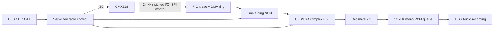

# Receiver architecture



## Signal processing

The convention is `I + jQ`: positive complex frequencies select USB, negative
frequencies select LSB. Upstream RF testing used this sign convention, but
orientation must be rechecked on the actual board, including below 2 MHz
where the driver changes LO injection. Wrong orientation exchanges USB/LSB.
No undocumented conjugation correction has been assumed.

The `vco-experiments` branch accepts 1 Hz steps over 70 kHz–130 MHz. Below
2 MHz the driver calibrates the requested LO first, then changes Fc to 2 MHz
with the original IF sign to select HF mixer routing, without recalculating
the PLL. It verifies that CTRL, N/F/R and programmed/active L are unchanged,
as well as HF LNA selection and PLL lock. This hardware routing override does
not change the software dial or DSP tuning arithmetic.

The chip tunes to the nearest
100 Hz; a 32-bit phase accumulator translates by the remaining −50…+49 Hz
at 24 kHz. A 1024-entry Q15 sine table supplies complex rotation. The result
feeds a 257-tap complex bandpass FIR, generated from a Blackman-windowed sinc
with 1200 Hz half-width and +1500 Hz center. USB computes
`Re(h * (I+jQ))`; LSB conjugates the filter. The design edges are 300/2700 Hz;
they are transition centers, not flat-passband limits. Host tests check
450–2500 Hz tones and >60 dB rejection of their opposite-sideband images.
They also check DC and alias-band attenuation; these are software results.

The FIR is evaluated on every second input sample and therefore also filters
before decimation to 12 kHz. Accumulators are 64-bit, with saturating 16-bit
output. NCO mixing reserves headroom to avoid intermediate wrap. There is no
AM/FM demodulation, audio AGC, squelch, volume control or transmit path.
Filter history and NCO phase reset at every configuration boundary. The first
100 ms of captured input is processed but its audio is discarded to suppress
chip/filter settling transients. This mute occurs only during configuration. Nominal
FIR group delay is 5.33 ms; the audio FIFO targets 8 ms, plus capture and USB
buffering. Actual latency and processor scheduling margin require measurement.

Regenerate or verify the checked-in tables with:

```sh
python3 scripts/generate_dsp.py
python3 scripts/generate_dsp.py --check
```

## USB and task ownership

One USB configuration contains two IAD functions: audio control/streaming
interfaces 0/1, and CDC control/data interfaces 2/3. Audio alternate 0 consumes
no bandwidth; alternate 1 exposes a 26-byte asynchronous isochronous IN endpoint
at 1 ms intervals. Mono PCM is 16-bit little endian. Only the 12,000 Hz discrete
format is advertised. Sampling frequency SET_CUR accepts only that rate;
GET_CUR/MIN/MAX return it and GET_RES returns zero. There is no feature unit.

The CMX918 and USB clocks are independent. The packetizer normally sends 12
samples; it sends 11 or 13 when FIFO occupancy falls below or rises above its
72–120 sample window. This avoids cumulative sample loss from ordinary crystal
drift. A 384-sample FIFO primes at 96 samples and sends silence until primed.
Synthetic tests cover 30 seconds at ±500 ppm with 2 ms input blocks and assert
that no samples are lost, duplicated or reordered. This does not establish
sustained timing on RP2350 or USB host compatibility.

The audio task waits on USB endpoint availability. Writes are bounded to 4 ms;
timeouts clear audio and increment a USB stall counter. Underflow re-primes
with silence and increments an underrun counter; overflow drops queued audio
and increments an overrun counter. Suspend, close, reset and reconfiguration
clear queued data and cancel pending writes. One packet already handed to USB
DPRAM (up to 13 samples) can finish across a tuning boundary. Host-side audio
buffers may contain older audio too. UAC PCM itself carries no generation tags;
CAT counters expose discontinuities separately.

Radio control owns the chip, capture and DSP. It services capture at 250 µs
intervals with at most two 48-sample blocks per iteration. USB never waits on
I2C. CAT admits one outstanding command and bounds serial reply writes to
100 ms. A host that stops reading CDC cannot block radio acquisition. The
CMX918 configure operation is bounded to 3 seconds; mute operations to 100 ms.
Queries can wait behind configuration, including startup. Counters saturate.

## References

- [USB Audio 1.0](https://www.usb.org/sites/default/files/audio10.pdf), sections
  4.3, 4.5, 4.6 and 5.2.3: topology, streaming descriptors and rate requests.
- [USB audio terminal types 1.0](https://www.usb.org/sites/default/files/termt10.pdf),
  radio receiver input terminal `0x0710` and USB streaming terminal `0x0101`.
- Pinned local sources: `embassy-usb` 0.6.0 builder, CDC and UAC1 speaker;
  `embassy-rp` 0.10.0 USB endpoint implementation. The recording class in this
  repository is original code using those APIs, not a copy of the speaker class.
- [Source provenance](PROVENANCE.md), including inherited hardware references.
