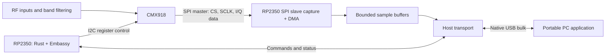

# Initial implementation plan

Latest reflash check, 12:36 UTC: receiver `C1E27EA41B7ECCC3` passes flash
verification, I2C and USB pattern checks, but physical SPI stalls without samples
at 12/24 ksps. Inspect the CS/clock/data wiring before further RF tests on this
identity. Earlier successful SPI measurements used `A71CD5C0A010DEF2`.
See [diagnostic evidence](REFLASH-2026-09-09.md).

Hardware update, 2026-09-09: RP2350A boot, USB enumeration and SWD/RTT are working.
Follow-up testing confirms Linux USB access and 20 consecutive successful CMX918
STATUS/RSSI probes at `0x55`; the initial NACK is no longer reproduced.
Baseline register programming/calibration and two short SPI-to-USB captures now
pass at 100 MHz, 10 kHz bandwidth and 24 ksample/s after correcting the endless
DMA count. Electrical timing, sustained streaming and controlled RF tests remain
the next gates; no rate is qualified. The ±250 Hz continuation was stopped
after ten passing 50 MHz triplets; 70/130 MHz remain unrun. Measurements use
explicit crystal trim at the owner's selected 10/30/40/50/70/130 MHz centers;
240 ksps failed its USB pattern gate. The earlier fine sweep is retained as
partial evidence. See the
[RF test report](RF-TESTING-2026-09-09.md) and [table](RF-RESULTS-2026-09-09.md).
See [bring-up evidence](BRINGUP-2026-09-09.md).

The host now includes `scripts/capture_waterfall.py`: supply the receiver center
in MHz to retain ten seconds of raw I/Q and generate a PNG. Transport remains
in the USB capture adapter; waterfall rendering also works offline from saved
capture metadata. See the [usage instructions](../README.md#record-iq-and-a-waterfall-png).

Updated 2026-09-08: the owner limits this prototype to sample rates that fit
native RP2350 USB. Initial Rust + Embassy firmware, Python USB capture, matrix
generation, FFT analysis and a generator helper are implemented. Firmware uses
PIO0 SPI slave/DMA0, async I2C and three USB bulk endpoints. `defmt` traces run
over nonblocking RTT. See [firmware instructions](../firmware/README.md) and the
[implemented protocol](PROTOCOL.md). Transport benchmarks and RF validation
still require hardware; no rate is advertised as qualified.
See [REFERENCES.md](REFERENCES.md) for document revisions and evidence.

## Architecture and stack decision

Keep Rust + Embassy. The current `embassy-rp` documentation provides RP2350,
async I2C, USB, and PIO RX DMA support. Inspection of its standard SPI driver
found no public slave-mode constructor; do not assume `new_rxonly` provides
slave operation. Evaluate a small Rust PAC-backed SPI slave driver or a PIO
receiver supervised by Embassy. PIO assembly embedded in Rust is within this
stack choice.

Capture feasibility remains a measurement gate. In particular, the Table 6
maximum serial clock is 38.4 MHz across the chip's complete profile set. The
USB-limited prototype will choose lower clocks matching its selected profiles;
the unused fastest setting is not an implementation requirement. For context,
at a proposed 150 MHz RP2350 system clock,
that leaves only about 3.91 system cycles per serial bit. A naive multi-instruction
PIO edge-wait loop may not meet timing. Account for instruction count, input
synchronizers, phase uncertainty, CS handling, and DMA before selecting it;
also check the fixed SPI slave's documented limits. Do not assume overclocking.
Investigate the actual clock configuration and fixed SPI slave support before
settling on PIO. The owner's working SPI slave example uses SPI1 with GPIO8/9/10
and is documented in [HARDWARE.md](HARDWARE.md). Failure of an initial PIO loop
is insufficient reason to abandon Rust.

A stack change requires a concrete blocker, minimal reproduction, measured
limits, investigated Rust alternatives, and the owner's approval. Native USB
bandwidth will remain the same under another firmware language.

## Electrical and chip interface

| Function | CMX918 connection | RP2350 role |
| --- | --- | --- |
| Register control SDA | Pin 17, control SDA | I2C controller data |
| Register control SCL | Pin 18, control clock | I2C controller clock |
| I/Q chip select | Pin 22, I2S_FRAME / CS | Input, SPI slave frame synchronization |
| I/Q data | Pin 23, I2S_DATA / SDA | Input, signed I/Q serial data |
| I/Q clock | Pin 24, I2S_SCLK | Input, clock supplied by CMX918 |

These are CMX918 package pins. Use RP2350 GPIO8 for data, GPIO9 for CS, and
GPIO10 for clock, as in the owner's example; see [HARDWARE.md](HARDWARE.md).
Before wiring, confirm the actual board, I/O supply and logic levels, control interface straps,
pull-ups, reset/enable connections, power sequencing, reference clock, and RF
input network against the datasheet and schematic. If using a DRM1000 module,
establish how its original CPU is isolated from the buses.

Use the 7-bit I2C address `0x55`; `0xAA`/`0xAB` are wire write/read address bytes.
Start conservatively and stay within the documented 400 kHz control limit.
Read registers with a register-address write followed by a repeated-start read.
The datasheet's I2C command format uses an 8-bit register address, including
addresses above `0x7F`, consistent with captures. The user manual's general
7-bit/page description must not be applied indiscriminately to I2C.

For SPI output, explicitly configure register `0x28` and related clock controls.
The datasheet specifies two's-complement 16-bit components, I then Q by default,
high byte first, with data valid on rising SCLK edges and programmable CS
polarity. Figure 13 depicts four data bytes followed by a one-byte-time pause;
capture must follow CS, not assume an uninterrupted stream of 32 clock bits.
Confirm idle clock, selected polarity, alignment, and channel order electrically.

## Sample rates and host bandwidth

CMX918 D/918/2.0, Table 6 (pp. 22–23), lists these sample-rate profiles:

| Filter bandwidth (kHz) | N | M | Rate at 2.4× (ksample/s) | Rate at 4.8× (ksample/s) |
| --- | --- | --- | --- | --- |
| 5 | 50 | 1 | 12 | 24 |
| 10 | 25 | 1 | 24 | 48 |
| 20 | 25 | 2 | 48 | 96 |
| 100 | 5 | 2 | 240 | 480 |
| 200 | 5 | 4 | 480 | 960 |

Sample rate, serial clock, and emitted frame rate are different quantities.
Table 6 contains clock ratios below and above one; the user manual's `0x5B`
includes repeated-frame versus single-transaction behavior when the ratio exceeds
one. Use a 1:1 sample/frame configuration where supported for initial validation.
Verify repeated frames and decreased-clock behavior before advertising those
combinations. Do not deduplicate equal-valued samples by value or silently drop
samples to accommodate a slower frame clock. Manual clock settings and any
additional supported profiles require a documented capability inventory and
measurement; the table above is the chip's standard-profile set. Only the seven
profiles at 12/24/48/96/240 ksample/s are in prototype scope. The standard 200 kHz
bandwidth profiles both exceed the USB budget and are excluded; do not invent a
200 kHz/240 ksample/s profile by silently dropping samples.

Assuming one complex sample is 16-bit I plus 16-bit Q, with only data bytes sent
to the host (decimal units):

| Complex samples/s | Payload bytes/s | Payload Mbit/s | Native full-speed USB assessment |
| --- | --- | --- | --- |
| 12,000 | 48,000 | 0.384 | Candidate; measure |
| 24,000 | 96,000 | 0.768 | Candidate; measure |
| 48,000 | 192,000 | 1.536 | Candidate; measure |
| 96,000 | 384,000 | 3.072 | Candidate; measure |
| 240,000 | 960,000 | 7.680 | Tight budget; sustained benchmark required |
| 480,000 | 1,920,000 | 15.360 | Excluded: exceeds native USB line rate |
| 960,000 | 3,840,000 | 30.720 | Excluded: exceeds native USB line rate |

Protocol headers, USB transactions, scheduling, and concurrent status/control add
overhead. Never use 12 Mbit/s as achievable sample payload throughput. Buffering
can absorb short stalls but cannot solve a permanent throughput deficit.

Proposed transport progression:

1. Implement a vendor-specific native USB bulk I/Q interface with separate
   control/status handling. Benchmark synthetic data at each candidate rate
   before coupling it to RF capture. CDC ACM may be added for diagnostics if useful.
2. Qualify 240 ksample/s explicitly: sustain 960,000 payload bytes/s plus protocol
   overhead, with status and commands active and realistic host scheduling.
   Advertise it only after passing. If it fails, report it as unavailable and
   keep the validated lower rates. No external high-speed bridge is in scope.
3. Qualify the complete CMX918 → RP2350 capture → native USB → host path at
   every advertised profile. Preserve all sample bits and expose discontinuities.

## Firmware and host behavior

Separate the portable CMX918 register driver and tuning arithmetic from board
support. Embassy tasks own chip control/calibration, capture buffer processing,
transport, and status. Capture runs through hardware and DMA into bounded buffers;
host delays must not stall the external sampling clock or monopolize control.

The initial wire contract is specified in [PROTOCOL.md](PROTOCOL.md). The broader
behavior below remains the design target; manual RF input/gain/divider control
and separate capture fault subtype counters are not implemented in v1:

- Versioned messages with bounded lengths and request IDs; defined byte order
  and explicit success/error responses. Handle fragmented/coalesced USB transfers.
- Commands for capabilities, configuration, start/stop, and status. Configuration
  includes center frequency in Hz, RF/input mode, filter bandwidth, sample rate,
  and gain/AGC. Demodulation modes must be distinguished from chip filter presets;
  initial firmware streams I/Q, with demodulation on the host if added.
- Capabilities describe valid profile combinations and limits per active
  transport, plus experimental versus validated frequency regions. Report actual
  applied settings and frequency quantization instead of silently rounding/wrapping.
- Sample blocks contain protocol version, payload length, stream/session identity,
  configuration generation, sequence number, first sample index, sample count,
  and discontinuity flags. Proposed payload is `I0, Q0, I1, Q1, ...`, signed 16-bit
  little-endian; electrical high-byte-first input is converted without losing bits.
- Status includes PLL/calibration state, RSSI with defined units/validity, active
  configuration, capture overflow, malformed frame, and host transport loss counters.
  If exact lost sample counts cannot be known, explicitly report unknown loss
  and restart the sample timeline rather than inventing continuity.
- Retune/rate changes mute or stop on a defined boundary, invalidate partial data,
  apply settings with bounded waits, then restart with a new generation. A stopped
  or failed stream remains controllable. Define overflow, disconnect, USB suspend,
  and reconnect behavior before implementation.

Use a Python host CLI initially, with a portable USB backend and block-oriented
capture. Separate transport from command and sample codecs for offline testing.
Record raw I/Q with a metadata sidecar describing settings, rate,
format, timing, and losses; consider SigMF during format selection. Add a GUI or
SDR application integration after reliable streaming. Document Linux permissions,
Windows driver binding, and macOS dependencies and verify each platform's package.

## Frequency validation

Treat 150 kHz–108 MHz as the manufacturer's general-coverage specification,
not proof that an arbitrary board receives it continuously. RF ports, matching,
filtering, calibration, and reference accuracy also constrain the usable range.
The requested approximately 100 kHz lower bound and 130 MHz upper bound are
experimental targets, and the final limits may differ in either direction.

The supplied DRM1000 work observed response at 128 MHz with L=4, but later
experiments found programmed L=3 behaving like effective L=7 and L=1 like L=5
in tested configurations. Do not reuse nominal 145 MHz recipes as proof of
fundamental reception. PLL-lock-only measurements and displayed frequencies
cannot establish usable coverage.

Validate the baseline, RF-input transitions, LF edge (including the datasheet's
high-side LO requirement at 150–281 kHz), and upper extension with a suitable
signal source. Measure wanted and image response, I/Q orientation, passband,
noise/sensitivity, and stability. Extend outward and check gaps; record exact
board, reference, profile, signal level, and measurements for supported limits.
Reject unsupported normal-operation settings; expose explicit experimental
profiles for investigation without changing validated capability claims.

## Implementation stages and acceptance

1. **Resolve hardware and transport.** Identify board/schematic, I/O levels,
   clock, pins, and bus isolation. Complete the rate/clock/profile inventory from
   both PDFs within the native USB scope. Freeze the initial
   protocol and document unresolved silicon behavior.
2. **Rust + Embassy bring-up.** Pin toolchain and dependencies, select the RP2350
   target, produce a repeatable build, and verify boot, USB enumeration, I2C
   identification/readback, reset, calibration, and bounded error recovery.
3. **Synthetic capture and transport.** Use a known-pattern external SPI source
   to exercise each required clock/CS configuration, signed values, I/Q order,
   DMA handovers, and timing margin. Benchmark host throughput concurrently with
   commands/status; measure overflow and disconnect recovery.
4. **CMX918 integration.** Implement traceable initialization, tuning, bandwidth,
   FIR/gain settings, and the selected USB-compatible profiles. Verify actual
   frame/sample rates and sample values with a logic analyzer and known RF input. Make retuning
   and every discontinuity visible in saved captures.
5. **Complete receiver qualification.** Run the [frequency matrix](TESTING.md)
   and validate native USB streaming. For each advertised profile,
   run at least 30 minutes under normal host load with no unreported loss, then
   exercise induced stalls and confirm accurate discontinuity reporting. Verify
   Linux first and repeat installation/capture/control checks on Windows/macOS.

Documentation and host-side tests can establish encoding and arithmetic, but
cannot substitute for timing, sustained throughput, or RF measurements. Record
which acceptance gates actually passed before claiming a working receiver.
